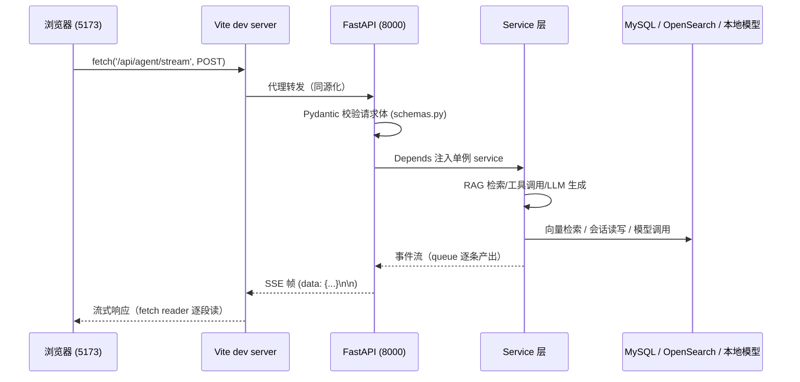

# 数据流全链路：一次请求在前后端之间怎么走

> 这是 [VUE_GUIDE.md](VUE_GUIDE.md)（前端）与 [FASTAPI_GUIDE.md](FASTAPI_GUIDE.md)
> （后端）的"缝合篇"：用四条真实链路把两端代码逐行对应起来。
> 读完你能做到：前端点一个按钮 → 指着 Network 面板 → 说出请求此刻在哪个文件哪一行。
> 代码路径相对各自目录（`frontend/` / `backend/`），行号以当前代码为准。

---

## 0. 两条总原则（先记住，后面全是细节）

1. **同源策略靠代理解决**：浏览器只允许页面访问"同源"地址。开发期前端跑在 5173、
   后端在 8000，二者不同源——但 Vite 开发服务器把 `/api/*` 的请求**转发**给 8000
   （frontend/vite.config.js:9-13），对浏览器来说请求是同源的，所以前端所有请求都写
   相对路径 `/api/...`（axios `baseURL: '/api'`，api/index.js:4-7）。生产环境同理：
   Nginx 把 /api 反代到 FastAPI（见 [NGINX_GUIDE.md](NGINX_GUIDE.md)）。
2. **分层契约**：前端函数（api/index.js）↔ HTTP 端点 ↔ Pydantic 模型（schemas.py）
   三层名称一一对应。后端路由拿到合法请求后只做两件事：调 service、翻译异常。
   任何"看不懂请求去哪了"的问题，先查 [FASTAPI_GUIDE.md 附：接口速查表]。

## 1. 全景图（开发环境）



---

## 2. 链路 B（主链路）：聊天页面发一条消息

这是项目最核心的链路：**用户输入 → Agent 思考 → 工具调用 → 流式回答**。
全程无刷新、有进度、可中止、可审批。

### 2.1 前端：用户输入与请求组装

模板里输入框绑定 `question`（v-model），发送按钮与 Enter 键都调 `send()`
（ChatView.vue:503 / :528）。`send()`（:1651-1852）前半段做"组装与占位"：

```js
async function send(options = {}) {
  flushTypewriter()
  const text = question.value.trim()
  if (!text || loading.value) return          // 空内容 / 已有请求在跑 → 不发
  messages.value.push({ role: 'user', content: text, images: imageDataUrls })
  const assistantMsg = {                       // 先放一条空 assistant 消息占位
    role: 'assistant', content: '', sources: [], tool_trace: [],
    permissions: [], todos: [], plan: [], … _streaming: true,
  }
  messages.value.push(assistantMsg)
  streamMsg = messages.value[messages.value.length - 1]   // 记住它，事件来了一层层填
  question.value = ''
  loading.value = true
  abortController = new AbortController()      // 用于"停止生成"
  // 三个开关 → 后端 tool_mode
  let effectiveMode = 'none'
  if (toolMode.value === 'auto' || (useWebSearch.value && useKnowledgeBase.value)) effectiveMode = 'auto'
  else if (useWebSearch.value) effectiveMode = 'web'
  else if (useKnowledgeBase.value) effectiveMode = 'knowledge'
  try {
    await streamAgentChat(
      { question: text, images: imageDataUrls, conversation_id: activeId.value,
        tool_mode: effectiveMode, template_id: templateId.value || null },
      { /* handlers，见 2.3 */ },
      { signal: abortController.signal },
    )
```

设计要点：**先渲染占位气泡，事件到达后逐字段填充**——界面在请求发出去的瞬间就
"动"了，token 没到也先显示状态。后端没有返回前，assistant 气泡里 tool_trace/permissions
全是空数组，事件填充后自动出现工具卡片、审批卡（响应式数组 push = 视图更新）。

### 2.2 前端：streamAgentChat 逐字节解析 SSE

`streamAgentChat` 在 api/index.js:19-85，是项目里最值得精读的前端函数：

```js
export async function streamAgentChat(payload = {}, handlers = {}, options = {}) {
  const response = await fetch('/api/agent/stream', {     // ① 为什么用 fetch 不是 EventSource？
    method: 'POST',                                        //    EventSource 只支持 GET；这里要 POST JSON body
    headers: { 'Content-Type': 'application/json' },
    body: JSON.stringify(payload),
    signal: options.signal,
  })
  if (!response.ok || !response.body) {                    // ② 非 200：读后端 HTTPException 的 detail
    const detail = await response.json().catch(() => null)
    throw new Error(detail?.detail || `HTTP ${response.status}，请确认后端已启动`)
  }
  const reader = response.body.getReader()                 // ③ ReadableStream 逐块读
  const decoder = new TextDecoder()
  let buffer = ''
  while (true) {
    const { done, value } = await reader.read()
    if (done) break
    buffer += decoder.decode(value, { stream: true })      // ④ stream:true：多字节中文可能在块边界被切开
    const frames = buffer.split('\n\n')                    // ⑤ SSE 帧以空行分隔
    buffer = frames.pop()                                  //    最后一段可能是半帧，留下次拼
    for (const frame of frames) {
      if (!frame.startsWith('data: ')) continue            // 心跳注释行 ": keepalive" 在这里被自然跳过
      let payload
      try { payload = JSON.parse(frame.slice(6)) } catch { continue }
      const { event, data } = payload
      // ⑥ 事件分发：每个事件找对应 handler（if-else 链）
      if (event === 'session' && handlers.onSession) handlers.onSession(data)
      else if (event === 'tool_start' && handlers.onToolStart) handlers.onToolStart(data)
      else if (event === 'permission_request' && handlers.onPermission) handlers.onPermission(data)
      else if (event === 'token' && handlers.onToken) handlers.onToken(data)
      else if (event === 'done' && handlers.onDone) handlers.onDone(data)
      else if (event === 'error') throw new Error(data?.message || data)
      // …还有 title/status/reasoning/plan_progress/vision/tool_result/
      //   permission_resolved/hook/todos
    }
  }
}
```

四个容易忽略的实现细节（面试/改代码都能聊）：

- **fetch 而非 axios 流**：axios 会把整个响应读完才 resolve，无法逐 token 渲染；
  fetch 的 `response.body` 是流，配合 `getReader()` 手写逐帧解析（这段是自研的
  轻量 SSE 客户端，没有引 SSE 库）；
- **半帧处理**：网络包边界不保证对齐 `\n\n`，所以攒 buffer、`split` 后把最后一段
  留到下一轮（`frames.pop()`）——少这一行，快速流式时会偶发丢事件；
- **多字节安全**：`decoder.decode(value, { stream: true })`——中文 UTF-8 3 字节可能
  跨 chunk 切开，不加 stream 标记会出乱码；
- **中止**：`AbortController` 的 signal 传给 fetch，调用 `abortController.abort()` 时
  fetch 抛 `AbortError`，由 send() 的 catch 捕获显示"（已停止生成）"（ChatView:1836-1838）。

### 2.3 前端：事件 handler 填状态

ChatView 传入的 handlers（:1708-1831）做的事本质都一样——**把后端推来的事件写进
`streamMsg`（那条占位消息）的字段**：

| 事件 | handler 做什么 | 用户看到的 |
|---|---|---|
| `session` | `activeId.value = data.conversation_id` + 更新会话列表 | 左侧列表出现新会话 |
| `status` | `currentTool.value = data.text` | 顶部"准备中/思考中…" |
| `tool_start` | `streamMsg.tool_trace.push({name, arguments})` | 出现工具卡（进行中） |
| `tool_result` | 回填该卡 `summary`/`detail`，`sources` 合并 | 工具卡内容+来源 |
| `permission_request` | `streamMsg.permissions.push({status:'pending'})` + 焦点移入 | 审批卡弹出（HITL） |
| `permission_resolved` | 卡片状态改 approved/denied | 审批卡变绿/变灰 |
| `token` | `pendingText.value += token` + `startTypewriter()` | 打字机效果逐字出现 |
| `done` | `flushTypewriter()`、`_streaming=false` | 流式结束，整条渲染为 Markdown |
| `error`（HTTP/事件层） | send() 的 catch：ElMessage.error | 错误提示 |

审批交互是个"旁路"：审批卡上的按钮不经过 SSE，而是再发一个普通 POST——
`resolvePermission(id, approve, reason, remember)`（api/index.js:285-299）打到
`/api/agent/permission/{requestId}/resolve`。后端 `permissions.py` 里
`permission_manager.wait()` 在等一个 threading.Event（每 0.5s 轮询一次），收到批准后
返回、worker 线程继续执行工具——所以**审批期间 SSE 连接保持打开但不发事件**（靠心跳
保活），批准后事件流接着走。

### 2.4 后端：agent_stream 从收请求到吐事件

前端那 150 行对应后端 api/agent.py:86-165。请求进来后：

1. **Pydantic 校验**：`request: AgentChatRequest` 不合法 → 422 直接返回（前端
   `response.ok` 为 false，读 `detail` 显示给用户——这就是 2.2 步骤②的取法）；
2. **依赖注入**：`service: AgentService = Depends(get_agent_service)`（单例）；
3. **生产者-消费者**（详读 FASTAPI_GUIDE §7）：worker 线程跑 `service.run()`，
   把每一步产出的事件 dict 塞 `queue`；async 生成器取队列逐条 `_sse(event)` 成帧
   yield；每 15s 无事件发一行 `: keepalive\n\n` 心跳；session 事件里注入 `run_id`
   （前端可据此调 `/agent/cancel/{run_id}` 中止）；
4. **断开检测**：客户端关闭（停止/关页）→ 生成器 finally → `stop_event.set()` →
   后台 worker 收尾（保存已生成内容、不落半截回答）。

`service.run()` 内部是 LangGraph 图（prepare → dispatch/subagent → agent ⇄ tools →
finalize），每步通过回调/事件产出上面的 SSE 事件；编排细节见
[AGENT_ORCHESTRATION_DETAILED.md](AGENT_ORCHESTRATION_DETAILED.md)。

### 2.5 会话落库与恢复（这条链路的两端收尾）

- **落库**：finalize 阶段把本轮完整消息（用户问题、assistant 回答、工具轨迹、来源）
  写入 MySQL `messages` 表（db/models.py Message）；
- **恢复**：切会话时前端 `getConversationMessages(id)`（GET /api/conversations/{id}/messages）
  拉历史渲染成普通气泡；输入框草稿才是 localStorage 的（前端隐私偏好），**完整对话
  永远在后端**——刷新页面丢的是草稿，不是历史。

---

## 3. 链路 A：RAG 普通问答（JSON）

日常 UI 不直接用，但它是"最短全链路"且 **eval_ragas.py 评测脚本**在用它，适合当
第二条教学链路。

```text
eval_ragas.py  →  POST /api/chat  {question, history: []}      (urllib 直连 8000)
api/chat.py:19 →  同步 def chat → service.acquire() 信号量 → service.ask()
rag/service.py:479 ask():
  1) retrieve(): 查询扩展(expand → 多路查询) → 每查询 hybrid_search
     → merge_query_results(RRF 融合, 上限 40) → small_to_big(父块聚合 ≤10)
     → reranker.rerank(top_k=6)
  2) context = "\n\n".join(docs)
  3) chat.generate(question, context)   → DeepSeek 生成
  4) sources = [{content, score, source, page}]   ← 每条引用可溯源到原始文档
  → {answer, sources} JSON 返回
eval_ragas.py 再把 sources 作为 retrieved_contexts、answer 作为 response，
用 RAGAS 打 faithfulness/context_recall/context_precision 分
```

注意 `def chat` 是同步函数：FastAPI 把它放线程池执行，所以内部可以放心阻塞
（信号量在这里控制并发 ≤4）。流式版 `/chat/stream` 逻辑相同，只是检索放
`run_in_threadpool`、生成用 `service.chat.astream` 逐 token 推送（api/chat.py:43-98）。

## 4. 链路 C：知识库文档上传 → 入库 → 检索可用

```text
KnowledgeView(页面)           api/index.js                 FastAPI                     Service
选择文件 → File 对象数组  →  uploadDocuments(files)  →  POST /api/documents/upload  →  service.add_documents(files)
                             new FormData()                  (multipart/form-data)        逐文件：
                             files.forEach(f =>             files: list[UploadFile]        ① 后缀白名单校验
                               form.append('files', f))     = File(...)  ← FastAPI         ② Path(filename).name
                             client.post('/documents/upload',  自动解析 multipart          （防路径穿越）
                               form)                      UploadFile.file 是              ③ write_bytes 落到
                             ← 浏览器自动带 Content-Type:   临时文件句柄                      data_dir/
                                 multipart/form-data;                                       ④ ensure_index() 增量入库
                                 boundary=...                                           （解析→切分→embed→去重→
                             → 返回 list[DocumentInfo]                                     OpenSearch upsert）
                             ← 前端刷新文档表格
```

三个值得记住的点：

1. **不需要手写 boundary**：FormData 交给 axios/浏览器，`Content-Type` 头让它自己带，
   手动设置反而会丢 boundary 报 422；
2. **后端防路径穿越**：service 只用 `Path(filename).name`（service.py:528）取文件名的
   最后一段，丢弃 `../` 等路径成分；预览/删除接口再有 `_resolve_document` 校验
   （documents.py:32-40）——文件类接口的安全红线，两条缺一不可；
3. **"增量"语义**：`add_documents` 写盘后 `ensure_index()` 扫描目录，按内容哈希跳过
   未变化的块（块级去重），只对新块建向量索引——这就是"新资料上传自动参与检索、
   重复内容不重复入库"的落点（详见 [RAG_PIPELINE_DETAILED.md](RAG_PIPELINE_DETAILED.md)）。

文档预览/查看原文是另一条只读链路：`GET /api/documents/file/{path}` 直接把原始字节
作为文件流返回（FileResponse + 显式 MIME），前端 pdf.js/epub.js 专业渲染（见
DOCUMENT_VIEWER_PLAN.md）。

## 5. 链路 D：设置读写与"改完立即生效"

```text
前端设置页 saveSettings(updates)            PUT /api/settings  {updates: {...}}
  → settings.py:62  save_overrides(db, updates)    ① 写 MySQL app_meta（键值覆盖层）
  → agent.refresh() / service.refresh()            ② 清空进程内缓存
  → 之后任何请求里的 effective() 都读新值         ③ 生效路径：
       有效值 = MySQL 覆盖 > env > 默认(config.py)
GET /api/settings 返回 editable 配置 + providers，api_key 一律 mask_key 只留后 4 位
  （settings.py:28-52：密钥不明文回浏览器——往返全程脱敏）
```

为什么"改完立即生效、重启不丢"能同时成立：配置分两层——`config.py` 的 Settings 是
静态默认（env 可覆盖），`app_meta` 表是用户覆盖层；`runtime_config.effective()` 每次
读取时先查覆盖层。service 里"会变"的值（供应商配置等）不缓存死，靠 `refresh()`
重新构建（这就是 FASTAPI_GUIDE 坑 6 的解法）。

## 6. SSE 事件协议速查表（两端对照）

| event（后端 emit） | 前端 handler | 载荷 data 关键字段 | 触发时机 |
|---|---|---|---|
| session | onSession | conversation_id, run_id(注入) | 会话建立 |
| title | onTitle | title | 后台生成标题完成 |
| status | onStatus | text | 阶段提示（准备/思考…） |
| reasoning | onReasoning | summary | 深度思考摘要（可关） |
| plan / plan_progress | onPlan / onPlanProgress | steps / done,total | 计划生成/进度 |
| todos | onTodos | todos[] | 任务清单 |
| vision | onVision | — | 图片识别中 |
| tool_start | onToolStart | name, arguments, id | 开始调工具 |
| tool_result | onToolResult | name, summary, detail?, sources? | 工具返回 |
| permission_request | onPermission | id, name, arguments, summary | 敏感操作待批 |
| permission_resolved | onPermissionResolved | id, approved, reason | 审批决定 |
| hook | onHook | name, decision | 钩子拦截/触发 |
| token | onToken | 字符串增量 | LLM 生成中 |
| done | onDone | — | 正常结束 |
| error | 抛异常进 catch | message | 出错 |
| （心跳，非事件） | 自动跳过 | `: keepalive` 注释行 | 15s 无事件时 |

后端要加新事件 = 改 service.run 产出 + agent.py 透传（它透传所有 dict）；前端要接
= api/index.js if-else 加一行 + ChatView handlers 加一个函数。**全链路改动不超过
三个文件**——动手练习 9 就是做这个。

## 7. 调试三板斧（针对本项目）

1. **浏览器 Network 面板**：过滤 `agent/stream` 看响应流是否持续有 `data:` 帧；
   切到 Response 标签能实时看到流（每帧到达都会追加）。断流就停在这里看是心跳没了
   还是 connection 挂了。
2. **后端日志**：uvicorn 终端有 service 层的 logger（检索耗时/扩展条数/工具失败）。
   用 `--reload` 时改代码自动重启；注意别把日志重定向到 backend 目录内文件
   （触发 reload 循环，见 FASTAPI_GUIDE 坑 9）。
3. **Swagger + curl**：`/docs` 里手动发一次 /api/agent/chat（非流式版，JSON 返回），
   快速判断问题在编排层还是传输层；curl 同理，且能加 `-N` 看原始流。

常见故障对照：

| 现象 | 大概率原因 | 查哪 |
|---|---|---|
| 前端提示"请确认后端已启动" | 8000 没起 / Vite 代理 target 错 | api/index.js:28 的兜底文案 |
| 422 一坨校验错误 | 请求体不合 schema | /docs 里看 loc 指向哪个字段 |
| 流到一半断掉且无 error | 客户端 Abort / 后端异常被 finally 收尾 | 后端日志 + agent.py finally |
| 生成"一顿一顿" | 缓冲头没设对（生产 Nginx） | X-Accel-Buffering 见 FASTAPI §7 |
| 改了后端不生效 | 没 --reload / reload 被打断 | 确认启动命令 |
| 上传中文名文件 404 | 路径编码问题 | api/index.js 分段 encodeURIComponent |

## 8. 练习（从"看懂"到"会改"）

1. 开 Network 面板发一条消息，**指着每条事件说出它对应 2.3 表里的哪个 handler**，
   至少等一次工具调用和一次 token 流；
2. curl 复现链路 A：`curl -X POST …/api/chat -d '{"question":"xxx"}'`，再对照
   eval_ragas.py 理解评测为什么能白嫖这条链路；
3. 用 F12 手动 `fetch('/api/agent/stream', {method:'POST',…})` 在 Console 里打印原始
   SSE 文本，对比 api/index.js 的解析逻辑；
4. 后端在 `service.run` 里临时 `logger.info` 打印每个事件名，跑一条消息对照前端
   收到的顺序——理解"谁先谁后"；
5. 上传一个 PDF，Network 里看 multipart 请求的 body 与后端 200 响应，再在 /docs 里
   GET /api/documents 看文件列表与状态；
6. 设置页改一次供应商/开关，MySQL 里 `SELECT * FROM app_meta` 看覆盖行，再改回——
   理解链路 D 的"覆盖层"；
7. 手动调一次 GET /api/settings，确认响应里所有 api_key 都是掩码形式（后 4 位）；
8. **端到端加一个新 SSE 事件**：后端某节点 emit `{"event":"my_event","data":…}` →
   agent.py 自动透传 → api/index.js 加一行分发 → ChatView 加 handler 显示 → 跑通后
   总结"改了几个文件"——这个练习做完，你对数据流就真的熟了。

## 9. 文档导航

- Vue 概念与前端写法：[VUE_GUIDE.md](VUE_GUIDE.md)
- FastAPI 结构/依赖/流式原理：[FASTAPI_GUIDE.md](FASTAPI_GUIDE.md)
- Agent 编排内部（SSE 事件来源）：[AGENT_ORCHESTRATION_DETAILED.md](AGENT_ORCHESTRATION_DETAILED.md)
- 检索管道细节（链路 A 的 retrieve 内部）：[RAG_PIPELINE_DETAILED.md](RAG_PIPELINE_DETAILED.md)
- 生产部署（Nginx 反代 /api、Docker）：[NGINX_GUIDE.md](NGINX_GUIDE.md) / [DOCKER_GUIDE.md](DOCKER_GUIDE.md)
